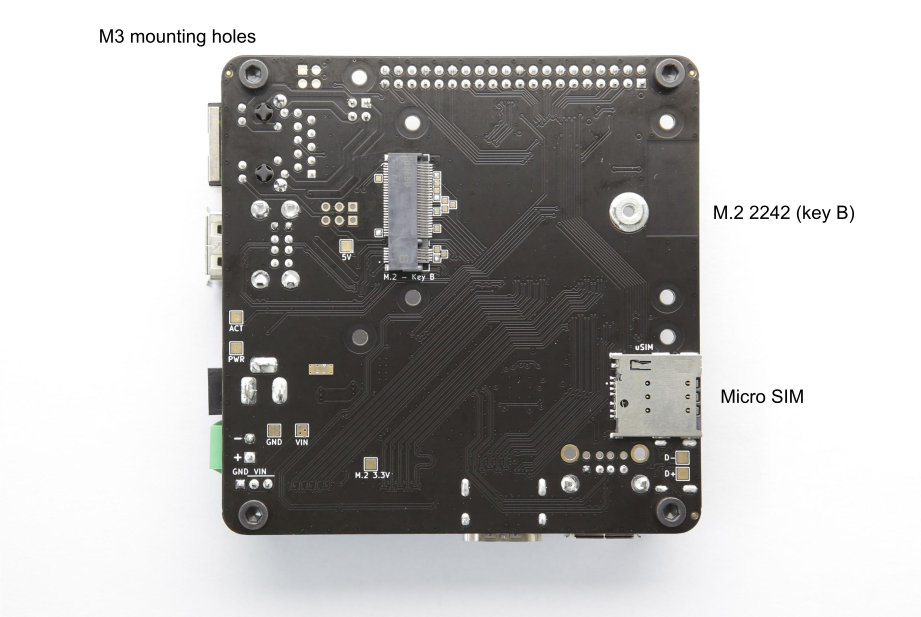

# TOFU Board
Designed by [**Oratek**](https://oratek.com) in Switzerland  
Version 1.1

## Overview
The TOFU board is a carrier board for use with Raspberry Pi Compute Module 4 (CM4).
Inspired by the official CM4IO board, it is intended for industrial applications.
With user friendly additions, it may also be used by enthusiasts looking for a compact yet complete solution to interface the many inputs and outputs of the single board computer.

  
TOFU board with mounted CM4

> ## Engineering Notice
The board has been updated to version V1.1 and V1.0 is no longer produced. V1.1 does not impact features, design or performance in any way but gives more design flexibility by moving away components placed underneath the Compute Module.
All present and future shipments will be V1.1. The version number is found on the packaging and on the board itself.
> #### V1.1 Changelog
**Added**
>- UKCA logo
**Changed**
>- Changed side of 3.3V fuse (F1)
>**Removed**
>- SIM_SW 0R (R31, below CM4)

## Features
The size of the board is 9x9cm and its main features are :

- Standard Raspberry Pi [40 pin GPIO header](https://pinout.xyz)
- Gigabit Ethernet port with PoE through the official Raspberry Pi PoE HAT
- M.2 2242/3042 socket (key B) with micro SIM card holder. See [compatibility list](#tested-compatibility-list).
- 3x USB-A ports
- Full size HDMI port
- Camera and display ports (newer 22pin version, flexible adapter cables can be purchased separately [here](https://store.oratek.com/collections/tofu))
- Two power inputs for industrial connectors (2.1mm barrel and standard 3.5mm terminal block)
- Large input voltage range, from 7.5 to 28V. Also available on 3x1 header pins for sharing to HATs requiring higher voltages (recommended power rating: >24W)
- Micro SD card slot. Only used for CM4Lite (no eMMC memory)
- USB-C port to use it as an OTG device and for programming purposes. May also be used to power the CM4, with power constraints if used with peripherals.
- Circuit protections added for safety reasons (ESD, over- and reverse-current protections)
- Standard Raspberry Pi, CM4 and 4 additional M3 mounting holes for design flexibility


M.2 connectivity (key B) enables to fully take advantage of the new PCIe lane (here with a LTE/GPS module)

## Operating temperature
The CM4 is rated from -20°C to 85°C. All components on the TOFU board comply with this range.
Apart from connectors, all electronic components are rated for -40°C or below.

## Layout

  
Top layer design (also see [pin configurations](#pin-configurations))

  
Bottom layer design

### Additional information
| Feature | Description|
| ----------------------| :----------------------|
| CM4 connectors | CM4 will be stacked at a 1.5mm height|
| Raspberry Pi header | Standard [40pin connector](https://pinout.xyz) |
| EEPROM WP, eMMC boot | Optional jumper (2.54mm pitch, see [pin configurations](#pin-configurations))|
| Gb Ethernet | ESD protected, Power over Ethernet (PoE) capabilities through the official [Raspberry Pi PoE HAT](https://www.raspberrypi.org/products/poe-hat/). If using this HAT, we recommend using 10mm, M2.5 spacers, and covering the transformer with electrical tape for added protection. Using this HAT, the board will be compatible with 802.3af PoE networks. The CM4 will also enjoy a little breeze from the included fan. A higher current than 2.5A is advised for all peripherals.|
| Double USB A | Stacked USB 2.0 connectors, 1.5A current limit for all USB ports|
| Main power fuse | Littelfuse, 3.5A, NANO2 ([045303.5MR](https://www.mouser.ch/ProductDetail/Littelfuse/0453035MR/?qs=qI%252BDxnNls1%2FE840Q9SUK5A%3D%3D), or similar) |
| PWR/ACT LEDs | Red power LED, green flashing activity LED |
| Power jack | 2.1mm inside, 5.5mm outside diameter. Outer connection is ground, inner conductor is positive voltage. |
| Terminal block | Standard 2 positions, 3.5mm pitch |
| AC/DC power supply | No external AC/DC power supply provided. 24W is the minimum recommended power. An example could be [ACM24US12](https://www.xppower.com/product/ACM24-Series?m=ACM24US12) from XP Power.|
| Input voltage breakout | Intended as power *output* (supply for connected HATs). Can be used as input but caution is advised as it is located after the reverse polarity protection. |
| Display, camera outputs | Standard Raspberry Pi connections, 22pin, 0.5mm pitch |
| HDMI port | ESD protected, current limit protection |
| Single/double USB A | Depending on whether a USB line is needed for the M.2 port, a single or double (stacked) connector can be mounted. The USB line can be deviated through two 0402 jumpers. |
| USB C port | ESD protected. When plugged, the board will switch to USB slave (connected USB devices will stop functioning). The USB C can power the Raspberry Pi for programming purposes. Power limitations can occur with peripherals due to the maximum current of 3A for USB-C.|
| Micro SD | Card slot for CM4 modules without eMMC. Push-push type connector. |
| Micro SIM | For use with compatible M.2 modules. Push-push type connector. |
| M.2 connector | The 2242 B key slot enables the use of SSDs, often with B+M key configuration, as well as network modules, which can then use the onboard micro SIM card. 1.5mm base height for the connected module. Network cards are more often available as 3042 format, which is also compatible. An adapter can be purchased separately to connect up to 2280 M key NVMe SSDs.|

Note: When powering the device through PoE or other power HATs (5V line of RPi header as power input), or with USB-C, a hissing noise may appear from the unused power supply. The fuse may be removed for silent operation in these cases.

*Edit note: After feedback from our customers, it appears PoE and power HATs will in fact power on the m.2 connector. However, the output current is often limited to 2.5A on these boards. We recommend a higher current rating for proper operation of all peripherals.*

## Tested compatibility list
### NVMe SSDs (M.2 2242)
- KingSpec NE 2242, 128GB
- Western Digital PC SN520, 128GB
- Transcend MTE452T, 128GB

### M key NVMe SSD (through adapter)
- Western Digital Blue SN550, 256GB, M.2 2280
- Western Digital Black SN750, 1TB, M.2 2280
- Samsung 970 Pro, 512GB, M.2 2280

### Wireless/LTE/GPS modules (M.2 3042)
- Huawei ME906s-158
- Huawei ME936
- Sierra Wireless AirPrime EM7345
- SIMCom SIM7600G-H

## Technical files
### Mechanical
- [STEP files](./_assets//TOFU.zip ':ignore :target=_blank')
- [Mechanical drawings](./_assets//TOFU-drawing.pdf ':ignore :target=_blank')  

### Electrical
- [Schematics](./_assets//TOFU-schematics.pdf ':ignore :target=_blank')  
- [Components reference](./_assets//TOFU-references.pdf ':ignore :target=_blank')  

## Setup

### Board features

To fully utilize the board possibilities, both USB ports and NVMe interfaces have to be enabled.

As indicated on the CM4IO board datasheet:  
"The USB interface is disabled to save power by default on the CM4. To enable it you need to add the following to the config.txt file :"
```
dtoverlay=dwc2,dr_mode=host
```

NVMe support is also  not enabled by default on Raspberry Pi OS. The command
```
sudo modprobe nvme-core
```
is needed, followed by a reboot to enable the NVMe kernel module.
More information on NVMe can be found on Jeff Geerling's CM4 [review](https://www.jeffgeerling.com/blog/2020/raspberry-pi-compute-module-4-review).

### eMMC boot
To boot on eMMC, hold down the nRPIBOOT button while plugging the USB-C cable for flashing (no other power input). The USB cable will power the CM4 while it boots. You may release the button after having plugged the cable. Then, you need to run the [rpiboot script](https://github.com/raspberrypi/usbboot). This can be done in two ways:

- If you have BalenaEtcher, open it. It will run the script in the background, and after a few seconds, your device will be recognized.
- Install rpiboot directly. For Linux/macOS, follow the [instructions on their github page](https://github.com/raspberrypi/usbboot). For Windows, you can [download the installer](https://github.com/raspberrypi/usbboot/raw/master/win32/rpiboot_setup.exe).

More information for flashing the eMMC can be found [here](https://www.raspberrypi.com/documentation/computers/compute-module.html#flashing-the-compute-module-emmc).

### Watchdog functions
The compute module behaves much like a Raspberry Pi 4. Thanks to this, one can use the same watchdog functions for reliability issues. You can have a look at [diode.io](https://diode.io/raspberry%20pi/running-forever-with-the-raspberry-pi-hardware-watchdog-20202/) for more information on how to use those. More information may also be found on this StackExchange [thread](https://raspberrypi.stackexchange.com/questions/108080/watchdog-on-the-rpi4).

### SSD mounting
First, you need to partition the storage, following this tutorial from [pidramble](https://www.pidramble.com/wiki/benchmarks/external-usb-drives). Note that /dev/sda1 will most likely be replaced by /dev/nvme0n1.

An alternate possibility for mounting can be found on Raspberry Pi's website, [here](https://www.raspberrypi.org/documentation/configuration/external-storage.md) (with a formatted device).

A neat benchmark test can be run to find your SSD performance by running the command from [pibenchmarks.com/](https://pibenchmarks.com/), where you'll see great results on the TOFU board in [Top Scores (SBC)](https://pibenchmarks.com/top/).

```
sudo curl https://raw.githubusercontent.com/TheRemote/PiBenchmarks/master/Storage.sh | sudo bash
```
This command has to be run in the disk location.

### NVMe SSD boot
Raspberry Pi now Supports NVMe SSD booting, and the TOFU board is the perfect companion for that! You may find more information on Raspberry Pi's [documentation](https://www.raspberrypi.com/documentation/computers/raspberry-pi.html#nvme-ssd-boot).

### Network cards
M.2 network cards often use the USB line of the connector as interface. Remember to enable the USB interface, as mentioned above.

The tested cards work natively using [Balena OS](https://www.balena.io/os/) with Network Manager and Modem Manager being pre-installed. You will just have to set up a configuration file and it works straight out of the box ([more details](https://www.balena.io/docs/reference/OS/network/2.x/#cellular-modem-setup)).

Another way is to manually install Network Manager and Modem Manager and configure it. This is not specific to the TOFU board but more general to Linux. A guide to get started can be found [here](https://techship.com/faq/how-to-guide-control-and-set-up-a-data-connection-in-linux-using-modemmanager-as-connection-manager).

### Camera and Display ports
On the TOFU board, the camera and display ports are cam1 and disp1. You can find help on enabling these on the Raspberry Pi documentation ([camera](https://www.raspberrypi.org/documentation/computers/compute-module.html#attaching-a-raspberry-pi-camera-module) and [display](https://www.raspberrypi.org/documentation/computers/compute-module.html#attaching-the-official-7-inch-display)).
You can for example download the file "[dt-blob-disp1-cam1.dts](https://datasheets.raspberrypi.com/cmio/dt-blob-disp1-cam1.dts)" at the bottom of the page.

You then need to compile the file (this will display lots of warnings which can be ignored):
```
sudo dtc -I dts -O dtb -o dt-blob-disp1-cam1.dtb dt-blob-disp1-cam1.dts
```
Then install the dt-blob.bin:
```
sudo cp dt-blob-disp1-cam1.dtb /boot/dt-blob.bin
```
reboot, and you should be all set.
More information can also be found [here](https://pi3g.com/2020/09/01/how-to-bring-up-the-camera-and-display-on-a-compute-module-carrier-board/).
To use the camera, you may refer to these guides on [libcamera software](https://www.raspberrypi.com/documentation/computers/camera_software.html#libcamera-and-libcamera-apps).

### Pin configurations
  
Boot and EEPROM options

  
Output voltage selection, Raspberry Pi 'Enable' and 'Run' pins, and wireless options

### Resources

- [Raspberry Pi Compute Module 4 datasheet](https://datasheets.raspberrypi.org/cm4/cm4-datasheet.pdf)
- [Raspberry Pi Compute Module 4 IO Board datasheet](https://datasheets.raspberrypi.org/cm4io/cm4io-datasheet.pdf)
- [General Raspberry Pi documentation](https://www.raspberrypi.org/documentation/)

<!--  
USB routing options -->

## Ordering options

- Complete (all connectors, 3x USB A, one USB line in M.2)
<!-- - Lite (no M.2 power supply, no M.2 connector, no SIM card holder, 4x USB A)-->

Other components may be removed (for example no M.2, 4x USB A) upon request for large quantities (>200 pieces)

For any enquiry, please contact us at hello@oratek.com

## Declarations of Conformity

- [RoHS Declaration of Conformity](./_assets/conformity//Oratek-RoHS_Declaration_of_Conformity.pdf ':ignore :target=_blank')  
- [CE Declaration of Conformity](./_assets/conformity//Oratek-Declaration_of_Conformity_for_TOFU_CE.pdf ':ignore :target=_blank')  
- [FCC Declaration of Conformity](./_assets/conformity//Oratek-Declaration_of_Conformity_for_TOFU_FCC.pdf ':ignore :target=_blank')  

*Raspberry Pi is a trademark of the Raspberry Pi Foundation*