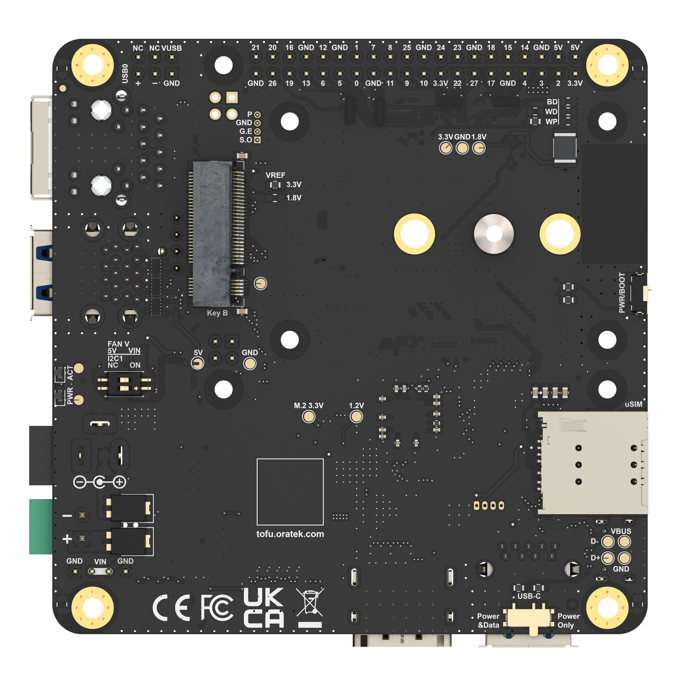
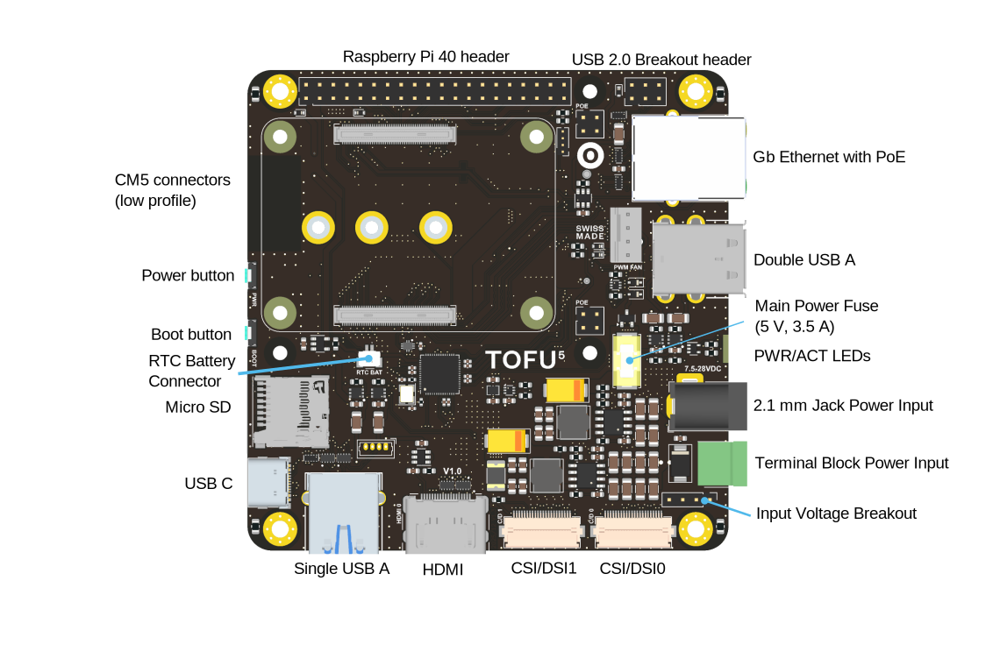
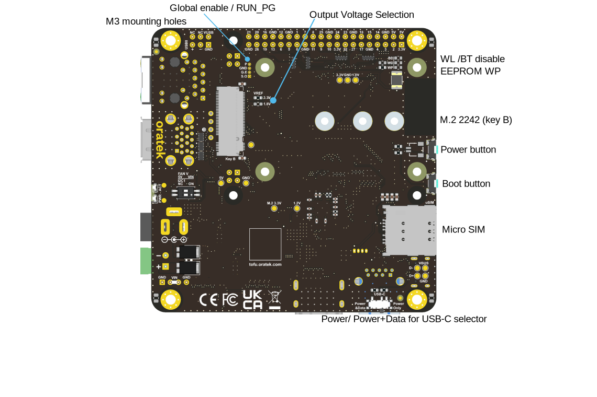
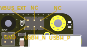
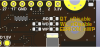
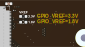
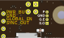
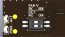

# TOFU5 Board
Designed by [**Oratek**](https://oratek.com) in Switzerland  
Version 1.0

## Overview
The TOFU5 is a versatile carrier board compatible with the Raspberry Pi Compute Module 5 (CM5). Building on the foundation of the original TOFU board, it introduces significant enhancements and additional functionalities while maintaining the same compact footprint as the TOFU V1.1.

With upgraded support for displays, cameras, and faster USB 3.0 ports when paired with the latest CM5, the TOFU5 enables seamless upgrades and new possibilities for your TOFU solutions across a variety of use cases.

Designed to operate across an extensive power range and equipped with improved protection features, the TOFU5 ensures reliable performance even in the most demanding scenarios.

  
TOFU5 board with mounted CM5

## Features
The size of the board is 9x9cm and its main features are:

- CM5 Assembly Slot
- Standard Raspberry Pi [40 pin GPIO header](https://pinout.xyz)
- 7-28V Input, 15W 3.3V/5A and 5V/3A Power Supplies
- Gigabit Ethernet Port, PoE/PoE+ Capability
  - Compatible with both POE and POE+ Raspberry Pi HATs (spacer required)
- M.2 Key B 2230/2242/3042/3052 Socket
  - PCIe (Gen2 x1) Connectivity
  - USB3.0 Connectivity
  - microSIM Card Holder
- 3x USB3.0 Type-A Ports 
  - Simple A Port Option [Molex 48405-0004 in place of 48406-0001]
  - 3x USB2.0 When Used With CM4
- 1x USB2.0 Breakout Header
- 1x Full-Size HDMI Port
- 2x 4-Lane Camera (CSI)/Display (DSI) Hybrid Ports
- Barrel Jack and Terminal Block Power Inputs
- USB-C Power/Data Input with CM5-Enabled Power Delivery (PD)
  - Up to 5V/5A Input
  - USB 2.0 Connectivity
- Micro SD Card Slot for Lite Modules
- 5V PWM Fan Port
- Real-Time Clock with external JST battery connector (same as Raspberry Pi 5)
- Activity, Power LEDs
- Boot Mode and Power Button 
- 2x Switch Inputs
  - (I2C1 Enable for Second CSI/DSI Interface)
  - Fan Voltage Selection (5V or VIN)
- Power Handling Capabilities
  - 3.3V Power Shutdown for all Interfaces
  - USB Power Shutdown
  - Key B Network Card Wireless Disable and Shutdown
- ESD Protection on All Inputs/Outputs
- Standard Raspberry Pi and 4 Additional M3 Mounting Holes


M.2 connectivity (key B) enables to fully take advantage of the new PCIe lane and USB3.0

## Operating temperature
The CM5 is rated from -20°C to 85°C. All components on the TOFU5 board comply with this range.
Apart from connectors, all electronic components are rated for -40°C or below.

## Layout

  
Top layer design (also see [pin configurations](#pin-configurations))

  
Bottom layer design

### Additional information
| Feature | Description|
| ----------------------| :----------------------|
| CM5 connectors | CM5 will be stacked at a 1.5mm height|
| Raspberry Pi header | Standard [40pin connector](https://pinout.xyz) |
| EEPROM WP, eMMC boot | Optional jumper (2.54mm pitch, see [pin configurations](#pin-configurations))|
| Gb Ethernet | ESD protected, Power over Ethernet (PoE) capabilities through the official [Raspberry Pi PoE HAT](https://www.raspberrypi.org/products/poe-hat/). If using this HAT, we recommend using 10mm, M2.5 spacers, and covering the transformer with electrical tape for added protection. Using this HAT, the board will be compatible with 802.3af PoE networks. The CM4 will also enjoy a little breeze from the included fan. A higher current than 2.5A is advised for all peripherals.|
| Double USB A | Stacked USB 3.0 connectors, 1.5A current limit for all USB ports|
| Main power fuse | Littelfuse, 3.5A, NANO2 ([045303.5MR](https://www.mouser.ch/ProductDetail/Littelfuse/0453035MR/?qs=qI%252BDxnNls1%2FE840Q9SUK5A%3D%3D), or similar) |
| PWR/ACT LEDs | Red power LED, green flashing activity LED |
| Power jack | 2.1mm inside, 5.5mm outside diameter. Outer connection is ground, inner conductor is positive voltage. |
| Terminal block | Standard 2 positions, 3.5mm pitch. |
| AC/DC power supply | No external AC/DC power supply provided. 24W is the minimum recommended power. An example could be [ACM24US12](https://www.xppower.com/product/ACM24-Series?m=ACM24US12) from XP Power.|
| Input voltage breakout | Intended as power *output* (supply for connected HATs). Can be used as input but caution is advised as it is located after the reverse polarity protection. |
| Display, camera outputs | Standard Raspberry Pi connections, 22pin, 0.5mm pitch. |
| HDMI port | ESD protected, current limit protection. |
| Single/double USB A | Depending on whether a USB line is needed for the M.2 port, a single or double (stacked) connector can be mounted. The USB line can be deviated through two 0402 jumpers. |
| USB C port | ESD protected. When plugged, the board will switch to USB slave (connected USB devices will stop functioning). The USB C can power the Raspberry Pi for programming purposes. Power limitations can occur with peripherals due to the maximum current of 3A for USB-C.|
| RTC | JST SH 2 pin connector reference [BM02B-SRSS-TB](https://www.jst.com/products/crimp-style-connectors-wire-to-board-type/sh-connector/) Pin 1 GND, Pin 2 VBAT. Use official [Raspberry Pi RTC Battery](https://www.raspberrypi.com/products/rtc-battery/) |
| Micro SD | Card slot for CM4 modules without eMMC. Push-push type connector. |
| Micro SIM | For use with compatible M.2 modules. Push-push type connector. |
| M.2 connector | The 2242 B key slot enables the use of SSDs, often with B+M key configuration, as well as network modules, which can then use the onboard micro SIM card. 1.5mm base height for the connected module. Network cards are more often available as 3042 format, which is also compatible. M.2 Key B connector provide a USB 2.0 + 3.0 bus and a PCIe Gen 2 bus.|

Note: When powering the device through PoE or other power HATs (5V line of RPi header as power input), or with USB-C, a hissing noise may appear from the unused power supply. The fuse may be removed for silent operation in these cases.

*Edit note: After feedback from our customers, it appears PoE and power HATs will in fact power on the m.2 connector. However, the output current is often limited to 2.5A on these boards. We recommend a higher current rating for proper operation of all peripherals.*

## Tested compatibility list
### NVMe SSDs (M.2 2242)
- KingSpec NE 2242, 128GB
- Western Digital PC SN520, 128GB
- Transcend MTE452T, 128GB

### M key NVMe SSD (through adapter)
- Western Digital Blue SN550, 256GB, M.2 2280
- Western Digital Black SN750, 1TB, M.2 2280
- Samsung 970 Pro, 512GB, M.2 2280

### Wireless/LTE/GPS modules (M.2 3042)
- Huawei ME906s-158
- Huawei ME936
- Sierra Wireless AirPrime EM7345
- SIMCom SIM7600G-H

## Technical files
### Mechanical
- [STEP files](../tofu5/_assets/TOFU5.zip ':ignore :target=_blank')
- [Mechanical drawings](../tofu5/_assets/TOFU5-drawing.pdf ':ignore :target=_blank')  

### Electrical
- [Schematics](../tofu5/_assets/TOFU5-schematics.pdf ':ignore :target=_blank')  


## Setup

### Board features

To fully utilize the board possibilities, both USB ports and NVMe interfaces have to be enabled.

As indicated on the CM5 datasheet:  
"The USB interface is disabled to save power by default on the CM4. To enable it you need to add the following to the config.txt file :"
```
dtoverlay=dwc2,dr_mode=host
```

NVMe support is also  not enabled by default on Raspberry Pi OS. The command
```
sudo modprobe nvme-core
```
is needed, followed by a reboot to enable the NVMe kernel module.
More information on NVMe can be found on Jeff Geerling's CM4 [review](https://www.jeffgeerling.com/blog/2020/raspberry-pi-compute-module-4-review).

### RTC Trickle Charging
To enable the trickle charging of the RTC when the CM5 is powered you'll need to add the following parameter in the '/boot/firmware/config.txt' file
```
dtparam=rtc_bbat_vchg=3000000
```

### eMMC boot
To boot on eMMC, hold down the nRPIBOOT button while plugging the USB-C cable for flashing (no other power input). The USB cable will power the CM4 while it boots. You may release the button after having plugged the cable. Then, you need to run the [rpiboot script](https://github.com/raspberrypi/usbboot). This can be done in two ways:

- If you have BalenaEtcher, open it. It will run the script in the background, and after a few seconds, your device will be recognized.
- Install rpiboot directly. For Linux/macOS, follow the [instructions on their github page](https://github.com/raspberrypi/usbboot). For Windows, you can [download the installer](https://github.com/raspberrypi/usbboot/raw/master/win32/rpiboot_setup.exe).

More information for flashing the eMMC can be found [here](https://www.raspberrypi.com/documentation/computers/compute-module.html#flashing-the-compute-module-emmc).

### Watchdog functions
The compute module behaves much like a Raspberry Pi 5. Thanks to this, one can use the same watchdog functions for reliability issues. You can have a look at [diode.io](https://diode.io/raspberry%20pi/running-forever-with-the-raspberry-pi-hardware-watchdog-20202/) for more information on how to use those. More information may also be found on this StackExchange [thread](https://raspberrypi.stackexchange.com/questions/108080/watchdog-on-the-rpi4).

### SSD mounting
First, you need to partition the storage, following this tutorial from [pidramble](https://www.pidramble.com/wiki/benchmarks/external-usb-drives). Note that /dev/sda1 will most likely be replaced by /dev/nvme0n1.

An alternate possibility for mounting can be found on Raspberry Pi's website, [here](https://www.raspberrypi.org/documentation/configuration/external-storage.md) (with a formatted device).

A neat benchmark test can be run to find your SSD performance by running the command from [pibenchmarks.com/](https://pibenchmarks.com/), where you'll see great results on the TOFU board in [Top Scores (SBC)](https://pibenchmarks.com/top/).

```
sudo curl https://raw.githubusercontent.com/TheRemote/PiBenchmarks/master/Storage.sh | sudo bash
```
This command has to be run in the disk location.

### NVMe SSD boot
Raspberry Pi now Supports NVMe SSD booting, and the TOFU board is the perfect companion for that! You may find more information on Raspberry Pi's [documentation](https://www.raspberrypi.com/documentation/computers/raspberry-pi.html#nvme-ssd-boot).

### USB-C Power / Data Config Switch
If a cable in plugged into the USB-C socket and sliding switch is on power+data position, the CM5 becomes a usb device (default) and its USB 2.0 bus is routed to the USB-C port.

If the sliding switch is in the power position, the USB-C port is used for power only and the CM5 USB 2.0 bus is routed to the USB 2.0 breakout header.
 

### Network cards
M.2 network cards often use the USB line of the connector as interface. Remember to enable the USB interface, as mentioned above.

The tested cards work natively using [Balena OS](https://www.balena.io/os/) with Network Manager and Modem Manager being pre-installed. You will just have to set up a configuration file and it works straight out of the box ([more details](https://www.balena.io/docs/reference/OS/network/2.x/#cellular-modem-setup)).

Another way is to manually install Network Manager and Modem Manager and configure it. This is not specific to the TOFU board but more general to Linux. A guide to get started can be found [here](https://techship.com/faq/how-to-guide-control-and-set-up-a-data-connection-in-linux-using-modemmanager-as-connection-manager).

### Camera and Display ports
On the TOFU board, the camera and display ports can be either C/D0 (CAM0/DISP0) or C/D1 (CAM1/DISP1)  and used independently for 2 cameras, 2 displays or camera + display.
To use the I2C on the C/D1 port, the I2C1 need to be activated thanks to the DIP switch (see [pin_configurations](#pin_configurations))

Here are example of dtoverlay commands (add it to the /boot/firmware/config.txt) for using the Raspberry Pi Camera Module 3 on the board:

On port C/D0
```
dtoverlay=imx708,cam0
```

On port C/D1
```
dtoverlay=imx708,cam1
```


Here are example of dtoverlay commands (add it to the /boot/firmware/config.txt) for using the Raspberry Pi Touch Display 2 on the board. Be sure the screen is powered, by using the 5 V rail accessible on the [40pin connector](https://pinout.xyz):

On port C/D0
```
dtoverlay=vc4-kms-dsi-ili9881-7inch,dsi0
```
On port C/D1
```
dtoverlay=vc4-kms-dsi-ili9881-7inch,dsi1
```

### Pin configurations
  
- WiFi Disable
- Bluetooth Disable
- EEPROM write protection

  
- GPIO output voltage selection, 3.3 V or 1.8 V.

  
- Power button
- Global Enable
- Sync Out.

 
- Select fan voltage 5 V or VIN
- Activate I2C1 Bus

### Warning
- Any external power supply used with the TOFU5 Board shall comply with relevant regulations and standards applicable in the country of intended use. 
- This product should be operated in a well-ventilated environment. If used inside a case, the case should not be covered and should allow for heat dissipation.
- Whilst in use, this product should be placed on a stable, flat, non-conductive surface, and should not be contacted by conductive items. 
- The connection of incompatible devices to the TOFU5 Board may affect compliance, result in damage to the unit, and invalidate the warranty. 
- All peripherals used with this product should comply with relevant standards for the country of use and be marked accordingly to ensure that safety and performance requirements are met. These articles include but are not limited to keyboards, monitors, and mice when used in conjunction with the TOFU5 Board. 
- The cables and connectors of all peripherals used with this product must have adequate insulation so that relevant safety requirements are met.

### Safety Instructions

To avoid malfunction or damage to this product, please observe the following: 
- Do not expose to water or moisture, or place on a conductive surface whilst in operation. 
- Do not expose yourself to excessive heat from any source. 
- Take care whilst handling to avoid mechanical or electrical damage to the printed circuit board and connectors. 
- Whilst it is powered, avoid handling the printed circuit board, or only handle it by the edges to minimise the risk of electrostatic discharge damage.


### Resources

- [Raspberry Pi Compute Module 5 datasheet](https://datasheets.raspberrypi.com/cm5/cm5-datasheet.pdf)
- [Raspberry Pi Compute Module 5 IO Board datasheet](https://datasheets.raspberrypi.com/cm5/cm5io-datasheet.pdf)
- [General Raspberry Pi documentation](https://www.raspberrypi.org/documentation/)

## Customisation

Oratek is an engineering firm at earth therefore any customization or development based on the TOFU is not only a possibility but also a reality. In the past years, we have developed numerous custom development and we are happy to hear any request. 

Please contact us at hello@oratek.com

## Declarations of Conformity

- [RoHS Declaration of Conformity](../_assets/conformity//Oratek-RoHS_Declaration_of_Conformity.pdf ':ignore :target=_blank')  
- [CE Declaration of Conformity](../tofu5/_assets/conformity/Oratek-TOFU5-CE-Declaration_of_Conformity.pdf ':ignore :target=_blank')  
- [FCC Declaration of Conformity](../tofu5/_assets/conformity/Oratek-TOFU5-FCC-Declaration_of_Conformity.pdf ':ignore :target=_blank')  
- [UKCA Declaration of Conformity](../tofu5/_assets/conformity/Oratek-TOFU5-UKCA-Declaration_of_Conformity.pdf ':ignore :target=_blank')  

*Raspberry Pi is a trademark of the Raspberry Pi Foundation*
